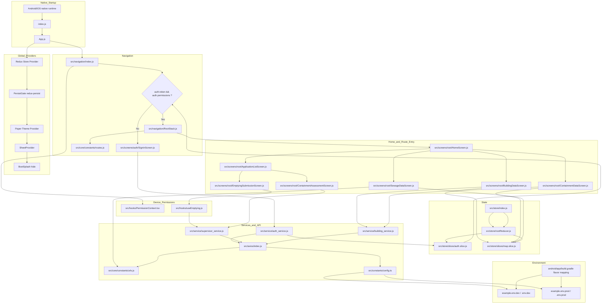

# QuickStart

## Project Snapshot

This is a **React Native** mobile application (JavaScript + some TypeScript) with:

- React Native `0.74.x`
- Redux Toolkit + Redux Persist for global state
- React Navigation (native stack) for routing
- Axios service layer for API communication
- Android flavor-based environment configuration (`dev` / `prod`)

Primary domain modules include building survey, emptying service, containment/sewer data, and map-driven workflows.

## Tech Stack

- Runtime: React Native, React 18
- Language: JavaScript-first with TypeScript-enabled config
- State: Redux Toolkit, React Redux, redux-persist
- Navigation: `@react-navigation/native`, `@react-navigation/native-stack`
- UI: `react-native-paper`, custom components
- Networking: Axios + centralized interceptors
- Env config: `react-native-config`

## Important Files and What They Do

### App Bootstrap

- `index.js`: React Native entrypoint (`AppRegistry.registerComponent`)
- `App.js`: Global providers and app shell initialization
  - Redux `Provider`
  - `PersistGate`
  - Paper theme provider
  - Action sheet provider
  - Bootsplash hide logic

### Routing and Navigation

- `src/navigation/index.js`: Auth gate (signin vs root stack)
- `src/navigation/RootStack.js`: Main stack screen registration
- `src/core/constants/routes.js`: Route name constants used across app
- `src/utils/navigation.js`: Navigation ref helper for imperative navigation

### Config and Environments

- `src/constants/config.ts`: Reads runtime env (`APP_CONFIG`, `BASE_URL`)
- `android/app/build.gradle`: Maps Android build variants to env files
  - `devDebug/devRelease -> .env.dev`
  - `prodDebug/prodRelease -> .env.prod`
- `example.env.dev`, `example.env.prod`: Environment templates

### State Management

- `src/store/index.js`: Redux store setup
- `src/store/rootReducer.js`: Combined reducers + persist config
- `src/store/slices/auth.slice.js`: Auth/user/permissions state
- `src/store/slices/map.slice.js`: Map-related state

### API Layer

- `src/axios/index.js`: Shared Axios client + interceptors + auth header
- `src/core/constants/urls.js`: API endpoint constants
- `src/service/*.js`: Feature-specific API wrappers
  - `auth_service.js`
  - `supervisor_service.js`
  - `building_service.js`

### Feature Areas

- `src/screens/auth/*`: Login/auth screens
- `src/screens/root/*`: Main app screens
- `src/components/*`: Reusable UI components by domain
- `src/hooks/PermissionContext.tsx`: Location/permission flow for Android/iOS

## High-Level Flow

1. App starts in `index.js` and renders `App.js`.
2. `App.js` initializes providers and loads persisted Redux state.
3. `src/navigation/index.js` decides route tree:
   - If token + permissions exist: load `RootStack`
   - Else: load sign-in screen
4. On login success, auth state is stored in Redux/AsyncStorage.
5. Screens call services (`src/service/*`) that use shared Axios client.
6. Base API URL comes from env files via `src/constants/config.ts`.

## Build and Run

## Prerequisites

- Node.js >= 18
- Yarn (project uses Yarn 3)
- Android Studio + SDK (for Android)
- Xcode + CocoaPods (for iOS on macOS)

## Install

```bash
yarn install
```

For iOS (macOS only):

```bash
cd ios
pod install
cd ..
```

## Environment Setup

Copy example env files and set real API host values:

```bash
cp example.env.dev .env.dev
cp example.env.prod .env.prod
```

Set at least:

```env
APP_CONFIG=development   # or production
BASE_URL=http://your-api-host
```

## Start Metro

```bash
yarn start
```

If needed:

```bash
yarn start --reset-cache
```

## Run Android

```bash
yarn android:dev
# or
yarn android:dev-release

yarn android:prod
# or
yarn android:prod-release
```

## Run iOS

```bash
yarn ios
```

## Quality and Tests

```bash
yarn lint
yarn test
```

## Contribution Guidelines (Project-Tailored)

No explicit `CONTRIBUTING.md` was found, so follow these conventions from the current codebase:

1. Use route constants, not hardcoded screen names.
   - Add/update route IDs in `src/core/constants/routes.js`
   - Register screens in `src/navigation/RootStack.js`
2. Add API integrations through the service layer.
   - Add endpoint key in `src/core/constants/urls.js`
   - Add wrapper function in `src/service/<feature>_service.js`
   - Consume wrappers from screens/hooks/components
3. Keep auth-sensitive logic centralized.
   - Token/permissions in `auth.slice.js`
   - Rely on `src/navigation/index.js` auth gate for stack switching
4. Keep feature code grouped by domain.
   - Screens in `src/screens/root/*`
   - Reusable UI in `src/components/<feature>/*`
5. Preserve existing style.
   - Existing code style is mostly JS with semicolon usage mixed by file
   - Run lint before opening PR

## Recommended PR Checklist

- [ ] Builds and runs in at least one target platform
- [ ] `yarn lint` passes
- [ ] `yarn test` passes (if tests affected)
- [ ] New route names added to constants and stack registration
- [ ] API additions wired through `urls.js` + service layer
- [ ] Env/config changes documented

## Common First Tasks for New Contributors

- Add a new root screen:
  1. Create screen under `src/screens/root`
  2. Add route constant in `src/core/constants/routes.js`
  3. Register in `src/navigation/RootStack.js`
  4. Add navigation trigger from Home or relevant module

- Add a new backend endpoint:
  1. Add endpoint path in `src/core/constants/urls.js`
  2. Add service function in `src/service/*`
  3. Call service from screen/hook and handle loading/error states

- Change API host per environment:
  1. Edit `.env.dev` / `.env.prod`
  2. Rebuild app variant (`android:dev` / `android:prod`)

## Notes and Pitfalls

- If login succeeds but app does not switch stacks, verify `token` and `permissions` are both set in auth state.
- If API calls fail unexpectedly, confirm `BASE_URL` and flavor/env mapping in Android Gradle.
- Some files use direct URL composition (`${BASE_URL_ENV}/api/...`) while others use Axios base URL; keep behavior consistent when adding new calls.

## Code Flow Diagram



## Critical Paths

1. Auth gate path:
   `App.js` -> `src/navigation/index.js` -> `src/screens/auth/SigninScreen.js` -> `src/service/auth_service.js` -> `src/axios/index.js` -> `src/store/slices/auth.slice.js` -> back to navigation gate.

2. Emptying workflow path:
   `src/screens/root/HomeScreen.js` -> `src/screens/root/ApplicationListScreen.js` -> `src/screens/root/EmptyingSubmissionScreen.js` -> `src/hooks/useEmptying.js` -> multipart POST to save-emptying endpoint (via URL/config constants).

3. Offline collection to upload path:
   map/field data staged in `src/store/slices/map.slice.js`, then uploaded from:
   `BuildingDataScreen`, `ContainmentDataScreen`, `SewageDataScreen`.

4. Config dependency path:
   `android/app/build.gradle` flavor selects env file -> `src/constants/config.ts` reads BASE_URL/APP_CONFIG -> `src/axios/index.js` and direct fetch-based upload screens consume API base URL.

