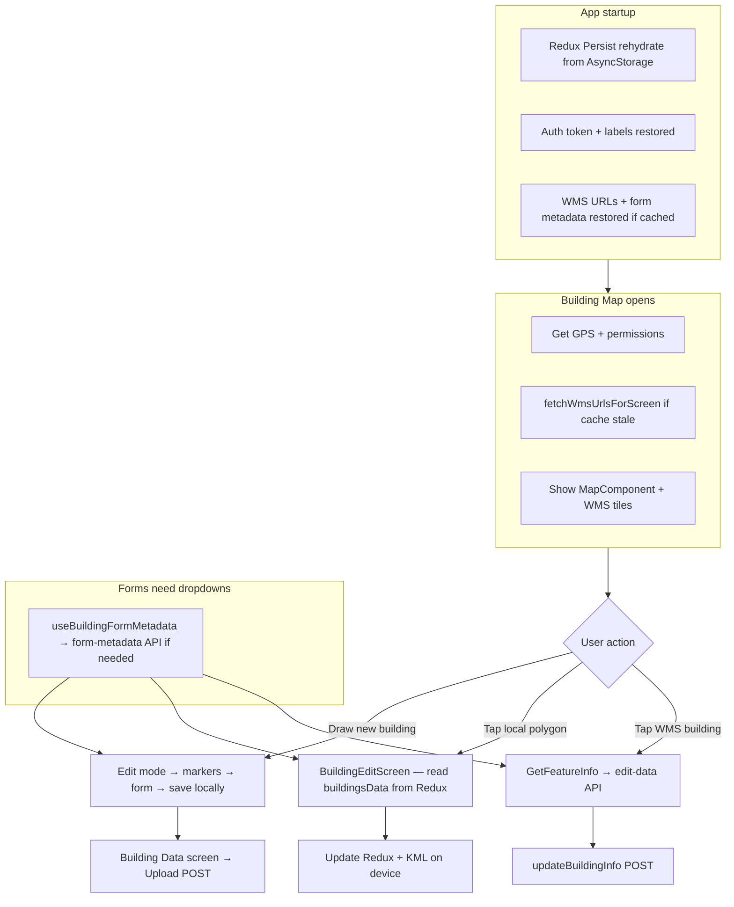

# Building Map & Forms — How It Works

Simple guide to how the map loads, **how data is fetched and cached**, how WMS layers show up, and how building **create**, **edit (local)**, and **edit (WMS/server)** work.

---

## Big picture




---

## 1. Map loading cycle

### Step 1 — Screen opens

File: `src/screens/root/BuildingMapScreen.js`

When the screen mounts it:

1. Asks for **location permission** and reads GPS.
2. Calls the API to get **WMS tile URLs** (building, road, ward).
3. Waits until location exists, then mounts the map (avoids a blank flash).

```257:323:src/screens/root/BuildingMapScreen.js
  useEffect(() => {
    if (permissionStatus && locationEnabled) {
      fetchLocation();
    } else {
      requestPermissions();
    }
  }, [permissionStatus, locationEnabled, fetchLocation]);

  useEffect(() => {
    dispatch(fetchWmsUrlsForScreen('building'));
  }, [dispatch]);

  useEffect(() => {
    if (!location) {
      setMapMounted(false);
      return undefined;
    }
    const task = InteractionManager.runAfterInteractions(() => {
      setMapMounted(true);
    });
    return () => task.cancel();
  }, [location]);
```

The map only renders when **permission + location + mapMounted** are all true:

```735:737:src/screens/root/BuildingMapScreen.js
      {locationEnabled && permissionStatus && location && mapMounted ? (
        <>
          <MapComponent
```

### Step 2 — WMS URLs are fetched and cached

File: `src/store/thunks/fetchWmsUrlsIfNeeded.js`

- For the `building` screen it needs layers: **road, ward, building** (`src/core/constants/wmsLayers.js` line 8).
- Each layer has its own API call (`getBuildingWmslink`, `getRoadWmsLink`, `getWardWmsLink`).
- URLs are stored in Redux `state.map.wmsUrls` and cached (not re-fetched if still fresh).

```136:165:src/store/thunks/fetchWmsUrlsIfNeeded.js
      const responses = await Promise.all(
        keysToFetch.map(layerKey => LAYER_FETCHERS[layerKey]()),
      );
      // ... parse each response into a tile URL template ...
      dispatch(
        setWmsUrlsSuccess({
          ...parsedUrls,
          fetchedAt: now,
          fetchedAtByLayer,
        }),
      );
```

### Step 3 — MapComponent renders Google Map

File: `src/components/mapcomponent/MapComponent.js`

- Uses `react-native-maps` with **Google provider**.
- Centers on user GPS (`initialRegion` with ~0.01 delta ≈ street level).
- Shows blue dot (`showsUserLocation`).
- Forwards `onPress`, `onRegionChangeComplete`, and map size via `onLayout`.

```31:50:src/components/mapcomponent/MapComponent.js
    <MapView
      ref={mapRef}
      style={styles.map}
      initialRegion={initialRegion}
      maxZoomLevel={20}
      onPress={handleMarkerPress}
      onRegionChangeComplete={onRegionChangeComplete}
      onLayout={onMapLayout}
      provider={PROVIDER_GOOGLE}
      showsUserLocation
      scrollEnabled={markerdrag ?? true}
      zoomEnabled={markerdrag ?? true}
      rotateEnabled={markerdrag ?? true}
```

### Step 4 — WMS tiles are drawn on top

Hook chain:


| Step                | File                                 | What it does                                                                                  |
| ------------------- | ------------------------------------ | --------------------------------------------------------------------------------------------- |
| Zoom from region    | `src/hooks/useMapZoom.js`            | Converts `latitudeDelta` → zoom level; waits 150ms after pan/zoom stops                        |
| Pick visible layers | `src/helpers/resolveWmsLayers.js`    | Checks zoom rules + user toggles + URL exists; overlay stays mounted while the map moves        |
| Merge same-endpoint | `src/helpers/mergeWmsLayerUrls.js`   | Collapses layers sharing a WMS endpoint into one `layers=a,b,c` GetMap request per tile         |
| Disk tile cache     | `src/helpers/wmsTileCache.js`        | Per-layer-set cache dir + 24h max-age (Android / Apple Maps); revisited tiles load from disk    |
| Draw tiles          | `src/components/map/WmsLayers.js`    | Renders one `<WMSTile>` per merged endpoint group                                               |


```177:195:src/screens/root/BuildingMapScreen.js
  const {stagedLayers, handleRegionChangeComplete: onMapRegionChangeComplete, zoom} =
    useWmsMapLayers({
      screenKey: 'building',
      mapMounted,
      wmsUrls,
      layerVisibility,
      forceLayers,
      onRegionChange: handleRegionChangeComplete,
    });
```

```src/components/map/WmsLayers.js
        <WMSTile
          key={tile.tileKey}
          urlTemplate={tile.urlTemplate}
          zIndex={tile.zIndex}
          opacity={0.5}
          tileSize={tileSize}
          minimumZ={tile.minimumZ}
          maximumZ={tile.maximumZ}
          tileCachePath={getWmsTileCachePath(tile.cacheName)}
          tileCacheMaxAge={WMS_TILE_CACHE_MAX_AGE_SEC}
        />
```

> Layers are merged before this render: `road`, `ward`, and `building` (which
> share a WMS endpoint) become a single `<WMSTile>` requesting
> `layers=road,ward,building`, instead of three separate tiles/requests. A layer
> on a different endpoint (e.g. `sewer`) falls back to its own tile. Default
> `tileSize` is 256. Staggered loading was removed — the full eligible set
> renders in one pass once `mapMounted` is true.

---

## 2. Data loading

This section covers **where each piece of data comes from**, when it is fetched, how it is cached, and what the user sees while loading.

### 2.1 Data sources at a glance


| Data                        | Where it lives                    | Loaded when                  | API / source                                  | Cached?                        |
| --------------------------- | --------------------------------- | ---------------------------- | --------------------------------------------- | ------------------------------ |
| Auth token                  | AsyncStorage + Redux `auth.token` | Login                        | `POST login`                                  | Yes (auth persist)             |
| UI labels (`contentsLabel`) | Redux `auth.contentsLabel`        | Header picks language        | `GET language/translations/{lang}`            | Yes (auth persist)             |
| WMS tile URLs               | Redux `map.wmsUrls`               | Login, Home, Map screen      | `GET wms/buildings`, `wms/roads`, `wms/wards` | Yes — 24h TTL, AsyncStorage    |
| Form dropdowns              | Redux `map.buildingFormMetadata`  | Login, Home, first form open | `GET building-info/buildings/form-metadata`   | Yes — 7 days TTL, AsyncStorage |
| Drawn polygon               | Redux `map.buildingCoords`        | User taps map in edit mode   | Local only                                    | No — memory only               |
| Local building drafts       | Redux `map.buildingsData[]`       | User saves create/edit       | Local Redux + KML file on disk                | **No** — lost if app killed*   |
| WMS building on tap         | Not stored                        | User taps map                | WMS `GetFeatureInfo` (GeoServer)              | No — per tap                   |
| WMS edit form values        | Screen state                      | Open WMS edit                | `GET building-info/buildings/{bin}/edit-data` | No — per screen visit          |
| Local edit form values      | From draft                        | Open local edit              | Redux `buildingsData[index]`                  | Already in memory              |


KML files remain in `DownloadDir`, but the app does not re-scan them on restart. The draft list in **Building Data** only shows what is still in `buildingsData`.

### 2.2 App startup — Redux Persist

File: `App.js` + `src/store/rootReducer.js`

On launch, `PersistGate` waits for AsyncStorage to **rehydrate** Redux before showing the app.

**Auth slice** (key `root`) — persisted:

- `token`, `username`, `account`, `permissions`, `currentLanguage`, `contentsLabel`, `languages`

**Map slice** (key `map`) — only these fields persisted:

```37:45:src/store/rootReducer.js
  whitelist: [
    'wmsUrls',
    'wmsUrlsFetchedAt',
    'wmsUrlsFetchedAtByLayer',
    'buildingFormMetadata',
    'buildingFormMetadataStatus',
    'buildingFormMetadataFetchedAt',
    'mapType',
  ],
```

**Not persisted** (in-memory for current session only):

- `buildingsData`, `buildingCoords`, `containmentData`, etc.

So after a cold start you may still have WMS URLs and form dropdowns ready, but **local building drafts disappear** unless the app stayed in memory.

### 2.3 Login — prefetch map + form data

File: `src/screens/auth/SigninScreen.js`

Right after a successful login, the app starts loading shared map/form data in the background (does not block navigation):

```117:118:src/screens/auth/SigninScreen.js
          dispatch(fetchWmsUrlsIfNeeded({ layers: BASE_WMS_LAYERS }));
          dispatch(fetchBuildingFormMetadata());
```

- Token is saved to AsyncStorage via `setValue("token", token)`.
- Permissions and account go to Redux auth.

### 2.4 Home screen — refresh cache

File: `src/screens/root/HomeScreen.js`

When Home loads, it may refresh the same caches (without `force`, so skipped if still fresh):

```50:58:src/screens/root/HomeScreen.js
  const refreshMapCache = (force = false) => {
    dispatch(fetchWmsUrlsIfNeeded({ layers: BASE_WMS_LAYERS, force }));
    dispatch(fetchBuildingFormMetadata({ force }));
  };

  const getPermissions = () => {
    setLoading(true);
    fetchLanguages();
    refreshMapCache(false);
```

### 2.5 WMS URL loading (detailed)

**Trigger:** `BuildingMapScreen` mount → `dispatch(fetchWmsUrlsForScreen('building'))`

**Flow:**

```
fetchWmsUrlsForScreen('building')
  → layers: road, ward, building
  → fetchWmsUrlsIfNeeded
      → skip if all URLs present AND fetched within 24h
      → else parallel API calls per missing/stale layer
      → parse each response → tile URL template
      → setWmsUrlsSuccess in Redux (+ AsyncStorage on next persist)
```

File: `src/store/thunks/fetchWmsUrlsIfNeeded.js`


| Layer key  | API function           | URL constant    |
| ---------- | ---------------------- | --------------- |
| `building` | `getBuildingWmslink()` | `wms/buildings` |
| `road`     | `getRoadWmsLink()`     | `wms/roads`     |
| `ward`     | `getWardWmsLink()`     | `wms/wards`     |


Cache TTL: **24 hours** (`src/helpers/cachePolicy.js` → `WMS_URLS_MS`).

**Status in Redux:** `wmsUrlsStatus` → `idle` | `loading` | `succeeded` | `failed`

Tiles themselves are **not** downloaded upfront — the map loads PNG tiles from GeoServer as you pan/zoom (`WMSTile` in `WmsLayers.js`).

### 2.6 Form metadata loading (dropdowns)

**Trigger:** Any screen using `useBuildingFormMetadata()` — mainly `BuildingDraftForm` (create + local edit) and `BuildingEditScreen` (WMS edit).

File: `src/hooks/useBuildingFormMetadata.js`

```19:23:src/hooks/useBuildingFormMetadata.js
  useEffect(() => {
    if (status === 'idle' || buildingFormMetadataStatus === undefined) {
      dispatch(fetchBuildingFormMetadata());
    }
  }, [status, buildingFormMetadataStatus, dispatch]);
```

**API:**

```11:16:src/service/building_service.js
export const getBuildingFormMetadata = async () => {
  return client.get(`${URLS.buildingInfoBuildings}/form-metadata`, {
    headers: {
      Accept: 'application/json',
    },
  });
};
```

Full path: `GET /api/building-info/buildings/form-metadata`

**Response** → stored as `buildingFormMetadata`. Dropdown lists are built by `buildFormDropdowns()`:

```10:31:src/helpers/buildingFormMetadata.js
export const buildFormDropdowns = (metadata, functionalUseId = '') => {
  // ward, road_code, structure_type, functional_use, use_category (depends on functional use), ...
  return {
    ward: mapToOptions(metadata?.ward),
    roadCode: mapToOptions(metadata?.road_code),
    // ...
  };
};
```

Cache TTL: **7 days** (`FORM_METADATA_MS`).

**Thunk skip logic** (`fetchBuildingFormMetadata.js`):

- Skip if already `loading`
- Skip if metadata exists and is not stale (unless `force: true`)
- On failure: if old metadata exists, keep it; if none, set `buildingFormMetadataStatus = 'failed'`

### 2.7 UI translation labels

File: `src/components/headers/Header.tsx`

Not building-specific, but every screen label uses `contentsLabel`:

```133:137:src/components/headers/Header.tsx
        getContentsLabel(langCode)
          .then((response) => {
            if (response.data && Object.keys(response.data).length > 0) {
              dispatch(setContentsLabel(response.data));
```

API: `GET /api/language/translations/{langCode}`

Loaded when user picks a language (or first language auto-selected). Persisted in auth slice.

### 2.8 Per-screen data loading

#### Building Map (`BuildingMapScreen`)


| Load                  | When         | Source                                         |
| --------------------- | ------------ | ---------------------------------------------- |
| GPS location          | Mount        | `getCurrentLocation()` device API              |
| WMS URLs              | Mount        | Redux cache or API (see 2.5)                   |
| Local polygons on map | Every render | `buildingsData` from Redux (already in memory) |
| WMS tiles             | Pan/zoom     | GeoServer via `WMSTile` URL templates          |
| WMS feature on tap    | User tap     | `getWmsFeatureInfo()` — live HTTP to WMS       |


#### Create form (`CreateBuildingAfterDrawScreen`)


| Load             | When        | Source                                              |
| ---------------- | ----------- | --------------------------------------------------- |
| Polygon coords   | Screen open | Redux `buildingCoords` (set on map before navigate) |
| Dropdown options | Form mount  | `useBuildingFormMetadata` → cache or API            |
| Form fields      | User input  | Local `values` state in `BuildingDraftForm`         |


#### Local edit (`BuildingEditScreen`, `source: 'local'`)


| Load                | When        | Source                                            |
| ------------------- | ----------- | ------------------------------------------------- |
| Building record     | Screen open | `buildingsData[route.params.index]`               |
| Initial form values | `useMemo`   | `mapLocalBuildingToFormValues(localBuildingItem)` |
| Dropdown options    | Form mount  | Same metadata hook as create                      |


No extra API call for building values — everything comes from the local draft.

#### WMS edit (`BuildingEditScreen`, `source: 'wms'`)

Two parallel loads when screen opens:

1. **Form metadata** (dropdowns) — same as above via `useBuildingFormMetadata`
2. **Building + containment data** — one API call:

```150:156:src/service/building_service.js
export const getBuildingEditData = async (bin) => {
  const path = `${URLS.buildingInfoEditData}/${encodeURIComponent(String(bin))}/edit-data`;
  return client.get(path, {
    headers: {
      Accept: 'application/json',
    },
  });
};
```

Full path: `GET /api/building-info/buildings/{bin}/edit-data`

Response shape used in screen:

```303:307:src/screens/root/BuildingEditScreen.js
        const res = await getBuildingEditData(bin);
        const {building = {}, containment = []} = res?.data?.data ?? {};
        setContainmentList(Array.isArray(containment) ? containment : []);
        const normalized = normalizeBuildingValues(building);
        setValues(prev => ({...prev, ...normalized}));
```

`normalizeBuildingValues()` maps many possible API field names to one form shape (e.g. `ownerName` → `owner_name`).

#### Building Data list (`BuildingDataScreen`)


| Load       | When             | Source                                                                 |
| ---------- | ---------------- | ---------------------------------------------------------------------- |
| Draft list | Screen open      | Redux `buildingsData` (no API)                                         |
| Upload     | User taps Upload | Reads token from AsyncStorage, builds `FormData`, `POST save-building` |


```76:88:src/screens/root/BuildingDataScreen.js
    const token = await AsyncStorage.getItem("token");
    const data = buildSaveBuildingFormData(item);

    const url = `${BASE_URL_ENV}/api/${URLS.uploadBuildingData}`;

    fetch(url, {
      method: "POST",
      body: data,
      headers: {
        Accept: "application/json",
        Authorization: `Bearer ${token}`,
      },
```

KML file is read from `item.path` on disk as part of `buildSaveBuildingFormData`.

### 2.9 WMS GetFeatureInfo (tap data load)

When user taps the map (not in draw mode, no local polygon hit), the app loads **one building feature** from the WMS server:

File: `src/service/wms_feature_info.js`

Steps:

1. Convert tap lat/lng → pixel `(x, y)` on map (`mapRef.pointForCoordinate`)
2. Build WMS `GetFeatureInfo` URL using current bbox, map size, layer name
3. `fetch(infoUrl)` → JSON with `features[0].properties.bin`
4. Navigate to edit with that BIN

This is **not cached** — every tap is a new request. Debounced to one tap per 400ms.

### 2.10 Loading UI (what user sees)


| Screen / state                                 | UI                                                     |
| ---------------------------------------------- | ------------------------------------------------------ |
| Map — no GPS permission                        | `ErrorMessage`: location denied                        |
| Map — waiting for GPS                          | Header only, map hidden until `location && mapMounted` |
| `BuildingDraftForm` — metadata loading         | Full-screen overlay: spinner + "Loading form options"  |
| `BuildingDraftForm` — metadata failed          | Overlay: error + Retry button                          |
| `BuildingEditScreen` (WMS) — metadata loading  | Same overlay: "Loading form options"                   |
| `BuildingEditScreen` (WMS) — edit-data loading | Overlay: "Loading edit data"                           |
| `BuildingEditScreen` (WMS) — both done         | Form fields render (`isReady && !loadingEditData`)     |
| `BuildingDataScreen` — upload                  | `LoadingSpinner` "Uploading"                           |


Draft form overlay logic:

```256:257:src/components/building/BuildingDraftForm.js
  const showMetadataOverlay =
    isInitialLoading || (!isReady && metadataStatus === 'failed');
```

WMS edit overlay logic:

```558:560:src/screens/root/BuildingEditScreen.js
  const showWmsOverlay =
    source === 'wms' &&
    (isInitialLoading || loadingEditData || (!isReady && metadataStatus === 'failed'));
```

Form fields stay hidden until metadata is ready — user cannot interact with empty dropdowns.

### 2.11 API auth for all requests

File: `src/axios/index.js`

Every API call (except raw `fetch` in BuildingDataScreen upload) goes through axios with:

```29:34:src/axios/index.js
      const token = await getValue("token");
      config.headers.Accept = `application/json`;

      if (token) {
        config.headers.Authorization = `Bearer ${token}`;
      }
```

Timeout: 13 seconds. On 401 → alert + logout.

### 2.12 Logout clears map cache

File: `src/components/headers/Header.tsx`

Logout dispatches `clearMapCache()` which wipes WMS URLs and f**o**rm metadata from Redux (next persist clears AsyncStorage map key too):

```115:121:src/store/slices/map.slice.js
    clearMapCache: state => {
      state.wmsUrls = {...emptyWmsUrls};
      state.wmsUrlsFetchedAt = null;
      state.wmsUrlsFetchedAtByLayer = {};
      state.wmsUrlsStatus = 'idle';
      state.wmsUrlsError = null;
      state.buildingFormMetadata = null;
```

---

## 3. Zoom, pan, and WMS layer rules

### How zoom is calculated

File: `src/hooks/useMapZoom.js`

Every time the user **stops** panning or zooming, `onRegionChangeComplete` fires:

```26:38:src/hooks/useMapZoom.js
  const onRegionChangeComplete = useCallback(
    nextRegion => {
      setRegion(nextRegion);
      setIsRegionStable(false);
      debounceRef.current = setTimeout(() => {
        setZoom(regionToZoom(nextRegion));
        setIsRegionStable(true);
      }, debounceMs);
    },
```

Zoom formula:

```3:8:src/hooks/useMapZoom.js
export function regionToZoom(region) {
  if (!region?.latitudeDelta) {
    return null;
  }
  return Math.round(Math.log2(360 / region.latitudeDelta));
}
```

**While the map is still moving**, WMS layers are **not** updated (`isRegionStable = false`). That stops tile flicker during fast panning.

### Minimum zoom per layer

File: `src/core/constants/wmsLayers.js`


| Layer    | Shows when zoom ≥ |
| -------- | ----------------- |
| Road     | 13                |
| Ward     | 13                |
| Building | 15                |


```15:21:src/core/constants/wmsLayers.js
export const ZOOM_LAYER_RULES = {
  road: {minZ: 13, maxZ: 22},
  ward: {minZ: 13, maxZ: 17},
  building: {minZ: 13, maxZ: 22},
```

The building layer shares the base-layer `minZ` of 13 so it is visible from the
initial map view. If a layer is on but the zoom is below its `minZ`, the **WMS
layers dialog** shows a hint: *"Zoom in for best layer detail"*
(`src/components/common/WmsView.js` lines 28–52).

### User toggles layers (FAB with layers icon)

File: `src/screens/root/BuildingMapScreen.js`

- Bottom-left **layers FAB** opens `WmsView` dialog.
- Checkboxes turn building / road / ward WMS on or off.
- Turning a layer **on** also sets `forceLayers` so it can show even below normal min zoom.

```199:223:src/screens/root/BuildingMapScreen.js
  const toggleLayer = useCallback((layerKey, isOn, setter) => {
    const next = !isOn;
    setter(next);
    setForceLayers(prev => {
      const updated = {...prev};
      if (next) {
        updated[layerKey] = true;
      } else {
        delete updated[layerKey];
      }
      return updated;
    });
  }, []);
```

### Pan and zoom during polygon edit

File: `src/components/mapcomponent/MapComponent.js`

When a marker is being dragged (`dragging = true`), `markerdrag` is passed as `false`:

```744:744:src/screens/root/BuildingMapScreen.js
            markerdrag={!dragging}
```

That **disables scroll/zoom/rotate** while dragging a corner so the marker move is clean. Otherwise pan and zoom work normally.

---

## 4. Create building (local) — full cycle

### A. Enter draw / edit mode

User taps the **+ FAB** (bottom-left, below layers):

```645:698:src/screens/root/BuildingMapScreen.js
  const onPressEditToggle = () => {
    if (!isEditing) {
      setIsEditing(true);
      setBuildingCoordsState(savedCoords || []);
    } else if (haveUnsavedChanges) {
      // asks to discard changes
    } else {
      setIsEditing(false);
    }
  };
```

When `isEditing = true`:

- Tapping the map **adds a marker** (polygon corner).
- Markers become **draggable**.
- Tapping a marker shows delete confirm.
- A green **Polygon** and edge distance labels appear.

```327:338:src/screens/root/BuildingMapScreen.js
  const handlePressOnMap = event => {
    if (!markerPressedRef.current) {
      const {latitude, longitude} = event.nativeEvent.coordinate;
      setBuildingCoordsState([...buildingCoordsState, {latitude, longitude}]);
    }
    markerPressedRef.current = false;
  };
```

```435:441:src/screens/root/BuildingMapScreen.js
  const handleMapPress = event => {
    if (isEditing) {
      handlePressOnMap(event);
      return;
    }
    // ... tap-to-select building logic (see section 5)
```

### B. Review coordinates → open form

User taps the **info button** (`MapInfoButton`) → `MapInfoModal` lists lat/lng per marker.

On **Next**:

```713:717:src/screens/root/BuildingMapScreen.js
  const onPressInfoNext = () => {
    setIsInfoModalVisible(false);
    dispatch(addBuildingCoordsData(buildingCoordsState));
    navigation.navigate(ROUTES.create_building_after_draw);
  };
```

Coords are saved to Redux `state.map.buildingCoords`.

### C. Create form screen

File: `src/screens/root/CreateBuildingAfterDrawScreen.js`

- Renders shared `**BuildingDraftForm**`.
- On save: builds KML file, stores draft in Redux `buildingsData`, clears draw coords.

```32:65:src/screens/root/CreateBuildingAfterDrawScreen.js
  const handleSave = useCallback(
    async ({sanitizedValues, houseImageFile}) => {
      const coords = polygonCoordsRef.current;
      // ... validate coords ...
      const kmlPath = `${RNFB.fs.dirs.DownloadDir}/${fileBase}.kml`;
      const xml = buildBuildingKml(coords, sanitizedValues.temp_building_code);
      await RNFB.fs.writeFile(kmlPath, xml);

      dispatch(
        addBuildingsData({
          ...sanitizedValues,
          coords,
          path: kmlPath,
          kml_file_name: `${fileBase}.kml`,
          house_image: houseImageFile,
          upload_status: 'pending',
        }),
      );
```

### D. BuildingDraftForm — how the form renders

File: `src/components/building/BuildingDraftForm.js`

1. `**useBuildingFormMetadata**` loads dropdown options from API (wards, roads, structure types, etc.) into Redux.
2. Form fields live in local `values` state.
3. Some fields show/hide based on answers (e.g. toilet yes → show sanitation fields).
4. **Save** runs validation, then calls parent `onSave`.

```172:185:src/components/building/BuildingDraftForm.js
  const handleSave = async () => {
    const sanitizedValues = sanitizeBuildingDraftByVisibility(values);
    const validationErrors = validateBuildingDraft(sanitizedValues);
    setErrors(validationErrors);
    if (Object.keys(validationErrors).length > 0) {
      Alert.alert(getLabel('Validation'), getLabel('Please fix form errors before saving.'));
      return;
    }
    await onSave?.({ sanitizedValues, houseImageFile });
  };
```

Used for:

- **Create** → `CreateBuildingAfterDrawScreen`
- **Edit local** → `BuildingEditScreen` when `source === 'local'`

### E. Upload to server (separate screen)

File: `src/screens/root/BuildingDataScreen.js`

Lists all local drafts. **Upload** sends KML + form fields via `buildSaveBuildingFormData` → POST API. On success, removes local entry and deletes KML file.

---

## 5. Edit building — local (saved on device)

### How user opens it

Two ways on the map:

1. **Tap inside a local polygon** (blue/red overlay from `buildingsData`).
2. Polygon has `onPress` → navigates to edit.

```401:423:src/screens/root/BuildingMapScreen.js
  const selectLocalBuildingByTap = coordinate => {
    const foundIndex = buildingsData.findIndex(
      b => !!b?.coords?.length && isPointInPolygon(coordinate, b.coords),
    );
    if (foundIndex >= 0) {
      onSelectLocalBuilding(foundIndex);
      return true;
    }
    return false;
  };
```

```347:360:src/screens/root/BuildingMapScreen.js
  const onSelectLocalBuilding = index => {
    if (isEditing) return;
    setSelectedBuildingIndex(index);
    setSelectedBuildingSource('local');
    navigation.navigate(ROUTES.building_edit, {source: 'local', index});
  };
```

Local polygons are drawn on the map:

```914:962:src/screens/root/BuildingMapScreen.js
            {!!buildingsData?.length &&
              buildingsData.map((item, index) => (
                  <Polygon
                    coordinates={item.coords}
                    tappable
                    onPress={() => onSelectLocalBuilding(index)}
                  />
              ))}
```

### Edit screen — local branch

File: `src/screens/root/BuildingEditScreen.js`

When `route.params.source === 'local'`:

1. Loads building from `buildingsData[index]`.
2. Maps stored fields → form via `mapLocalBuildingToFormValues`.
3. Shows `**BuildingDraftForm**` (same component as create).
4. On save: rewrites KML, updates Redux patch, keeps same polygon coords.

```562:582:src/screens/root/BuildingEditScreen.js
  if (source === 'local') {
    return (
      <View style={{flex: 1}}>
        <Header title={getLabel('Edit Building')} />
        <BuildingDraftForm
          initialValues={localFormInitialValues}
          initialHouseImage={localBuildingItem.house_image ?? null}
          onSave={handleLocalSave}
        />
      </View>
    );
  }
```

```499:536:src/screens/root/BuildingEditScreen.js
  const handleLocalSave = async ({sanitizedValues, houseImageFile}) => {
    const item = buildingsData?.[localIndex];
    const newPath = `${RNFB.fs.dirs.DownloadDir}/${fileBase}.kml`;
    const xml = buildBuildingKml(item.coords, sanitizedValues.temp_building_code);
    await RNFB.fs.writeFile(newPath, xml);
    dispatch(
      updateBuildingData({
        index: localIndex,
        patch: { ...sanitizedValues, coords: item.coords, path: newPath, ... },
      }),
    );
  };
```

**Note:** Local edit changes form + KML only. Upload still happens from **Building Data** screen.

---

## 6. Edit building — WMS (server building)

### How user opens it

When **not** in draw mode, a map tap:

1. First checks if tap is inside a **local** polygon → local edit (above).
2. Otherwise calls **WMS GetFeatureInfo** at tap point.

```485:537:src/screens/root/BuildingMapScreen.js
    void (async () => {
      const buildingUrl = wmsUrls?.building;
      const pointPx = await mapRef.current.pointForCoordinate(coordinate);
      const feature = await getWmsFeatureInfo({
        wmsTileTemplate: buildingUrl,
        coordinate,
        region: mapRegion,
        mapSizePx,
        pointPx,
      });
      if (feature) {
        onSelectWmsBuilding(feature);
      }
    })();
```

File: `src/service/wms_feature_info.js` — builds a WMS `GetFeatureInfo` URL using current map bbox, pixel x/y, returns JSON feature with `properties.bin`.

Navigation:

```365:396:src/screens/root/BuildingMapScreen.js
  const onSelectWmsBuilding = feature => {
    const bin = feature?.properties?.bin;
    navigation.navigate(ROUTES.building_edit, {source: 'wms', bin});
  };
```

Debounce: ignores taps within **400ms** of last tap and blocks double concurrent lookups (`featureInfoBusyRef`).

### Edit screen — WMS branch

File: `src/screens/root/BuildingEditScreen.js`

When `source === 'wms'`:

1. Shows loading overlay while fetching:
  - Form metadata (dropdowns) via `useBuildingFormMetadata`
  - Building data via `getBuildingEditData(bin)` API
2. Renders a **large inline form** (ScrollView + TextInput/SelectionInput) — **not** `BuildingDraftForm`.
3. Fields are normalized from API response (`normalizeBuildingValues`).
4. Conditional sections (LIC, toilet, sewer/drain, etc.) show based on field values.
5. **Save** → `updateBuildingInfo(bin, payload)` POST to server.

```298:320:src/screens/root/BuildingEditScreen.js
  useEffect(() => {
    if (source !== 'wms' || !bin) return;
    setLoadingEditData(true);
    (async () => {
      const res = await getBuildingEditData(bin);
      const {building = {}, containment = []} = res?.data?.data ?? {};
      setContainmentList(Array.isArray(containment) ? containment : []);
      const normalized = normalizeBuildingValues(building);
      setValues(prev => ({...prev, ...normalized}));
    })();
  }, [bin, source]);
```

```449:468:src/screens/root/BuildingEditScreen.js
  const handleWmsSubmit = async () => {
    const errs = validateWms();
    if (Object.keys(errs).length) { /* scroll to first error */ return; }
    await updateBuildingInfo(bin, payload);
    Alert.alert(getLabel('Saved'), ...);
  };
```

Also shows read-only **containment list** at the bottom (from same edit-data API).

---

## 7. Map tap behavior summary


| Mode                           | Map tap does                                                                  |
| ------------------------------ | ----------------------------------------------------------------------------- |
| **Edit/draw ON** (`isEditing`) | Add polygon corner marker                                                     |
| **Edit/draw OFF**              | 1) Hit-test local polygons → local edit 2) Else WMS GetFeatureInfo → WMS edit |
| **Marker drag**                | Pan/zoom disabled until drag ends                                             |
| **Local polygon tap**          | Opens local edit (also works via Polygon `onPress`)                           |


Edit mode blocks building selection:

```349:351:src/screens/root/BuildingMapScreen.js
    if (isEditing) {
      return;
    }
```

---

## 8. Redux state (map slice)

File: `src/store/slices/map.slice.js`


| State key                                      | Purpose                                       | Persisted to disk?              |
| ---------------------------------------------- | --------------------------------------------- | ------------------------------- |
| `buildingCoords`                               | Points while drawing a new polygon            | No                              |
| `buildingsData[]`                              | Local saved drafts (form + coords + KML path) | No                              |
| `wmsUrls`                                      | Tile URL templates per layer                  | Yes (24h effective TTL)         |
| `buildingFormMetadata`                         | Dropdown options for forms                    | Yes (7 day effective TTL)       |
| `wmsUrlsStatus` / `buildingFormMetadataStatus` | Loading state for thunks                      | Partially (metadata status yes) |
| `mapType`                                      | Standard / satellite                          | Yes                             |


Key actions:

- `addBuildingCoordsData` — save drawn polygon before form
- `addBuildingsData` — new local draft after create
- `updateBuildingData` — patch local draft after edit
- `removeBuildingData` — after upload or delete
- `resetBuildingCoords` — clear draw after save
- `clearMapCache` — logout; clears WMS + metadata cache

---

## 9. Key files quick reference


| File                                                | Role                                                    |
| --------------------------------------------------- | ------------------------------------------------------- |
| `src/store/rootReducer.js`                          | What gets persisted to AsyncStorage                     |
| `src/helpers/cachePolicy.js`                        | WMS (24h) and form metadata (7d) TTL                    |
| `src/store/thunks/fetchWmsUrlsIfNeeded.js`          | Fetch + cache WMS tile URL templates                    |
| `src/store/thunks/fetchBuildingFormMetadata.js`     | Fetch + cache form dropdown metadata                    |
| `src/hooks/useBuildingFormMetadata.js`              | Hook used by all building forms                         |
| `src/helpers/buildingFormMetadata.js`               | Turns API metadata → dropdown options                   |
| `src/screens/auth/SigninScreen.js`                  | Prefetch WMS + metadata on login                        |
| `src/screens/root/HomeScreen.js`                    | Refresh caches on home load                             |
| `src/axios/index.js`                                | Auth token on every API request                         |
| `src/screens/root/BuildingMapScreen.js`             | Main map, draw mode, tap handling, WMS + local overlays |
| `src/components/mapcomponent/MapComponent.js`       | Google Map wrapper, pan/zoom settings                   |
| `src/hooks/useWmsMapLayers.js`                      | Zoom + layer eligibility + staging                      |
| `src/components/map/WmsLayers.js`                   | WMSTile rendering                                       |
| `src/components/common/WmsView.js`                  | Layer toggle dialog                                     |
| `src/screens/root/CreateBuildingAfterDrawScreen.js` | Create form after draw                                  |
| `src/screens/root/BuildingEditScreen.js`            | Edit local (BuildingDraftForm) or WMS (inline form)     |
| `src/components/building/BuildingDraftForm.js`      | Shared create/local-edit form                           |
| `src/screens/root/BuildingDataScreen.js`            | List + upload local drafts                              |
| `src/service/wms_feature_info.js`                   | Tap → WMS feature lookup                                |
| `src/service/building_service.js`                   | WMS links, edit-data, update, upload                    |
| `src/core/constants/wmsLayers.js`                   | Which layers per screen + zoom rules                    |


---

## 10. End-to-end flows (short)

### Create new building

```
Map → + FAB (edit mode) → tap corners → info button → Next
→ CreateBuildingAfterDrawScreen → BuildingDraftForm → Save Locally
→ buildingsData in Redux + KML on disk
→ Building Data screen → Upload → server
```

### Edit local building

```
Map → tap blue local polygon → BuildingEditScreen (local)
→ BuildingDraftForm → Save → update Redux + new KML
→ Upload later from Building Data
```

### Edit WMS (server) building

```
Map → zoom ≥ 13 → tap WMS building → GetFeatureInfo → BIN
→ BuildingEditScreen (wms) → load API data → edit inline form → Save
→ updateBuildingInfo API (immediate server save)
```

